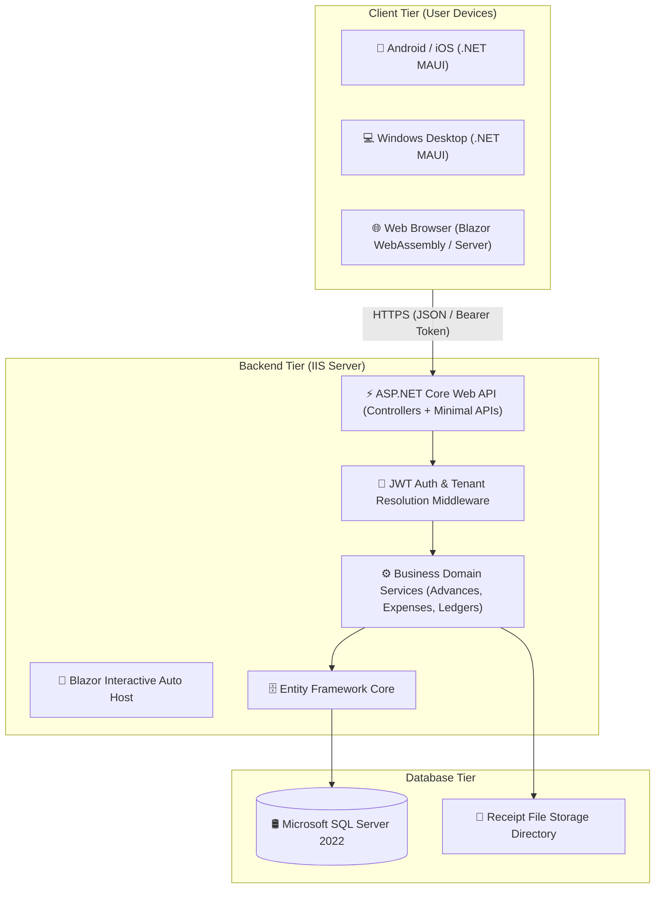
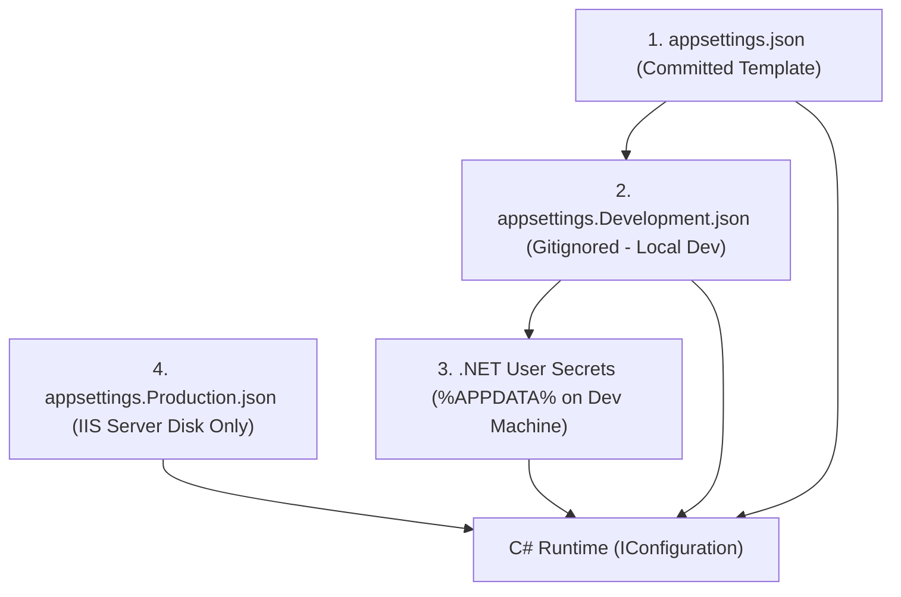

# Petty Cash & Expense Management System (PettyCashDatabase)

[](https://github.com/YourOrg/PettyCash/actions)
[](https://dotnet.microsoft.com/)
[](#architecture-overview)
[](#)

> Enterprise-grade, multi-tenant Petty Cash & Expense Management application built with **.NET MAUI Blazor Hybrid**, **ASP.NET Core Web API / Blazor Interactive Auto Mode**, **Entity Framework Core**, and **Microsoft SQL Server**.

---

## 📑 Table of Contents
- [Architecture Overview](#-architecture-overview)
- [Solution Structure](#-solution-structure)
- [Configuration & Secrets Hierarchy](#-configuration--secrets-hierarchy)
- [Getting Started (Local Development)](#-getting-started-local-development)
- [Testing Strategy](#-testing-strategy)
- [CI/CD & Deployment (IIS)](#-cicd--deployment-iis)
- [Git Workflow & Branch Protection](#-git-workflow--branch-protection)
- [Documentation Index](#-documentation-index)

---

## 🏛 Architecture Overview

The system follows **Clean Architecture** with strict layer separation and multi-tenant security isolation (PB-RBAC):



---

## 📂 Solution Structure

The solution (`PettyCashDatabase.slnx`) contains the following specialized projects located in the repository root:

```text
c:\Zillion\PettyCashDatabase\
├── PettyCashDatabase/                   # .NET MAUI Blazor Hybrid Client (Android, iOS, MacCatalyst, Windows Desktop)
│   ├── Components/                      # Native & Blazor WebView host components
│   ├── Platforms/                       # Platform-specific native entry points (Android, iOS, Windows, etc.)
│   ├── Properties/                      # Build & launch configuration
│   ├── Resources/                       # App icons, splash screens, fonts, styles, and raw assets
│   ├── Services/                        # Device-specific service implementations (e.g., FormFactor)
│   ├── App.xaml / MainPage.xaml         # MAUI App shell & BlazorWebView container
│   ├── MauiProgram.cs                   # MAUI bootstrapping, service registration & Blazor WebView setup
│   └── PettyCashDatabase.csproj         # MAUI project configuration (.NET 10 multi-targeted)
├── PettyCashDatabase.Shared/            # Shared Razor components, UI layout, pages, and cross-platform contracts
│   ├── Layout/                          # Shared layouts (MainLayout, NavMenu, etc.)
│   ├── Pages/                           # Reusable Razor pages & views (Home, Counter, Weather, NotFound)
│   ├── Services/                        # Common domain & abstraction interfaces (IFormFactor)
│   ├── wwwroot/                         # Shared stylesheets (app.css, bootstrap) and static web assets
│   ├── Routes.razor                     # Shared client-side routing component
│   └── PettyCashDatabase.Shared.csproj  # Shared Razor class library (.NET 10)
├── PettyCashDatabase.Web/               # ASP.NET Core Host, Server Rendering & Web API backend
│   ├── Components/                      # Root App component (App.razor) and server hosting pages
│   ├── Properties/                      # Launch settings & environment profiles (launchSettings.json)
│   ├── Services/                        # Web host service implementations (FormFactor)
│   ├── appsettings.json                 # Base application configuration
│   ├── appsettings.Development.json     # Development environment configuration
│   ├── Program.cs                       # Web host entry point, middleware pipeline & Auto render mode configuration
│   └── PettyCashDatabase.Web.csproj     # ASP.NET Core Web project (.NET 10)
├── PettyCashDatabase.Web.Client/        # Blazor WebAssembly Client Bundle (Interactive Auto render mode)
│   ├── Layout/                          # Client-side reconnection UI (ReconnectModal)
│   ├── Services/                        # WebAssembly client implementations (FormFactor)
│   ├── wwwroot/                         # Client static assets & WASM runtime configurations
│   ├── Program.cs                       # WebAssembly client bootstrapping & DI
│   └── PettyCashDatabase.Web.Client.csproj # Blazor WebAssembly project (.NET 10)
├── PettyCashDatabase.slnx               # Modern XML-based Visual Studio Solution file
├── SeedGeographicData.sql               # Database seed script for geographic / administrative data
├── .gitignore                           # Git exclusions (build artifacts, bin/obj, user secrets)
└── README.md                            # Project documentation & developer onboarding guide
```

---

## 🔒 Configuration & Secrets Hierarchy

This repository strictly enforces **Zero-Secrets-in-Source-Control**. Secrets are layered according to environment:



| File / Location | Purpose | Committed to Git? | Example Values |
| :--- | :--- | :---: | :--- |
| **`PettyCashDatabase.Web/appsettings.json`** | Base configuration blueprint & defaults | ✅ **Yes** | `"Logging"`, `"AllowedHosts"` |
| **`PettyCashDatabase.Web/appsettings.Development.json`** | Local development credentials | ❌ **Gitignored** | Local SQL connection string, Sandbox API keys |
| **`.NET User Secrets`** | Local secrets storage (`%APPDATA%`) | ❌ **Outside Git** | Local sensitive development credentials |
| **`appsettings.Production.json`** | Live production server credentials | ❌ **Server Only** | Live SQL connection string, Live Payment API keys |

### Adding Local Configuration
When onboarding or pulling new changes, configure `PettyCashDatabase.Web/appsettings.Development.json` locally:
```json
{
  "ConnectionStrings": {
    "DefaultConnection": "Server=(localdb)\\mssqllocaldb;Database=PettyCashDb_Dev;Trusted_Connection=True;MultipleActiveResultSets=true"
  },
  "JwtSettings": {
    "Secret": "DevelopmentSecretKeyMustBeAtLeast32CharsLong123!",
    "Issuer": "PettyCashServer",
    "Audience": "PettyCashClient",
    "ExpiryMinutes": 480
  },
  "PayPal": {
    "Mode": "Sandbox",
    "ClientId": "YOUR_LOCAL_SANDBOX_CLIENT_ID",
    "ClientSecret": "YOUR_LOCAL_SANDBOX_SECRET"
  }
}
```

---

## 🚀 Getting Started (Local Development)

### Prerequisites
1. [.NET 10.0 SDK](https://dotnet.microsoft.com/download)
2. [Visual Studio 2022 / Visual Studio Code](https://visualstudio.microsoft.com/) with workloads:
   - **ASP.NET and web development**
   - **.NET Multi-platform App UI development (.NET MAUI)**
3. [SQL Server 2022 Express / LocalDB](https://www.microsoft.com/sql-server)

### Running the Web API & Blazor Application
```powershell
# 1. Restore NuGet packages
dotnet restore PettyCashDatabase.slnx

# 2. Apply Database Migrations (if EF Core migrations are configured)
dotnet ef database update --project PettyCashDatabase.Web

# 3. Launch Web Host (Kestrel)
dotnet run --project PettyCashDatabase.Web
```
*Access Web Portal at:* `https://localhost:7223` or `http://localhost:5062`

### Running the .NET MAUI Client (Windows Desktop)
```powershell
dotnet run --project PettyCashDatabase/PettyCashDatabase.csproj -f net10.0-windows10.0.19041.0
```

---

## 🧪 Testing Strategy

The solution utilizes automated testing to ensure contract safety, security compliance, and ledger calculation accuracy:

```powershell
# Run the complete test suite
dotnet test PettyCashDatabase.slnx

# Run security audit on dependencies
dotnet audit
```

* **Unit Tests:** Fast, in-memory validation of policy limits, tax calculators, password hashing, and token claims without database dependencies.
* **Integration Tests:** End-to-end validation of `WebApplicationFactory`, multi-tenant middleware, and database transaction lifecycles.
* **Security & Rate Limiting Tests:** Validates brute-force lockout and RBAC authorization headers.

---

## 📦 CI/CD & Deployment (IIS)

Deployments are automated through **GitHub Actions** targeting **Internet Information Services (IIS)**:

1. **Pull Requests & Commits (`ci.yml`):**
   * Automatically restores, compiles, and tests the entire solution.
   * Runs `dotnet audit` to block vulnerable packages.
2. **Main Branch Merges (`deploy-iis.yml`):**
   * Publishes the Release build (`dotnet publish`).
   * Safely transitions the IIS application using `app_offline.htm`.
   * Deploys the binaries to `C:\inetpub\wwwroot\PettyCashDatabase`.
   * Performs an automated HTTP health check (`/api/health`).

---

## 🌿 Git Workflow & Branch Protection

We follow the **GitFlow** branching model:

```text
main (Production Releases only)
  └── develop (Integration branch for staging)
        ├── feature/auth-jwt-system
        ├── feature/advance-requests
        └── bugfix/ledger-reconciliation
```

### Branch Rules
* **Direct pushes to `main` and `develop` are strictly blocked.**
* All changes must be submitted via **Pull Request (PR)**.
* PRs require at least **1 peer review approval** and **all CI checks green** before merging.

---

## 📚 Documentation Index
Comprehensive Stage 1–3 engineering artifacts mapped in `PettyCashDatabase.slnx`:
* [Stage 1: Project Planning & Charters](Documentations/Planning/ProjectPlanning.html)
* [Stage 2: Requirements Analysis & User Stories](Documentations/Requirements/RequirementsAnalysis.html)
* [Stage 3: System Design & Architecture Specification](Documentations/System%20Design/SystemDesign.html)
* [Database Schema DDL](Documentations/System%20Design/schema.sql)
* [Seed Geographic Data](SeedGeographicData.sql)
